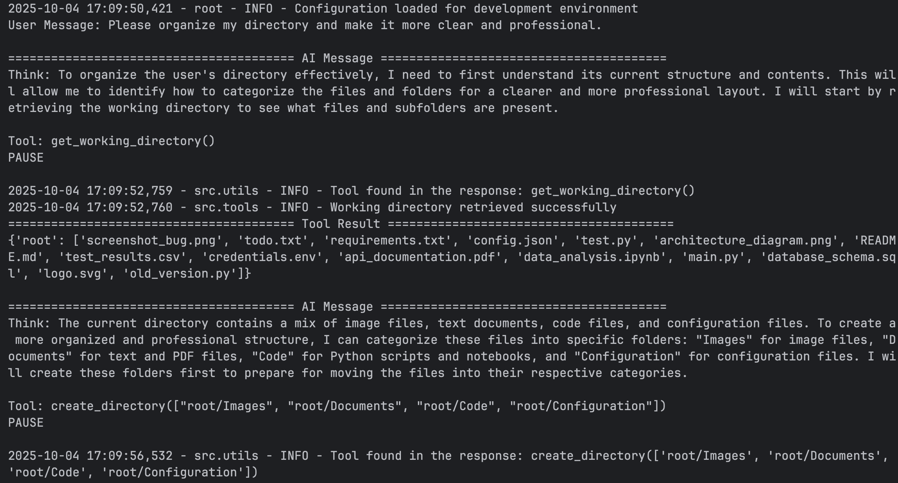

# ReAct Agent From Scratch
> Zero-dependency implementation of the ReAct (Reasoning and Acting) pattern from scratch using pure python and object-oriented programming.
> This agent can organize messy directories by reasoning about file organization and taking actions through filesystem tools.

## Why This Project Matters?
Building this agent without relying on any third-party library or framework demonstrates a deep, hands-on understanding of agentic AI fundamentals and architectures. By implementing every component myself, I gained true insight into the LLM capabilities and limitations without abstract barriers.  

## Requirements
- Python 3.11
- OpenAI API Key

## Features
1. **No Dependencies**: Fully implemented using Python's standard library. No LangChain, CrewAI, or third-party frameworks.
2. **ReAct Pattern**: Uses an LLM as the reasoning engine of the agent and makes decisions in a Think -> Action -> Observe loop.
3. **Filesystem Organization**: Automatically organizes files by type, purpose, or custom criteria.
4. **Transparent Reasoning**: Outputs the agent’s thinking process at every step, making debugging and agent logic easy to follow for users and developers.


## How This Agent Works
At its core, CoT (Chain of Thought) prompt engineering technique is used to guide the agent's thinking process.
It guides the agent to generate thoughts on the problem and then to take actions based on the thoughts to solve the problem in an iterative loop.

Here’s what the agent loop looks like:
1. **Think**: Agent analyzes the context and reasons about how it can solve it.
2. **Action**: Takes action (tool use) based on thoughts.
3. **Observe** : Receives and evaluates the action results.
4. **Repeat**: Continues until the problem is solved.


## Available Tools
- **get_working_directory()**: Returns current working directory and structure.
- **create_directory(paths: List[str])**: Creates a directory with the given paths.
- **move_files(mapping: Dict[str, str])**: Moves a file to a new path.`



## Quick Start

### 1. Clone and Setup

```bash

git clone https://github.com/PeymanKh/react-agent-from-scratch.git
cd react-agent-from-scratch

python -m venv .venv
source .venv/bin/activate  # activate the environment

pip install -r requirements.txt
```

### 2. Configure API Key
Copy .env.example to .env as follows and add your OPENAI_API_KEY.
```bash

cp .env.example .env
# Next edit .env
```

### 3. Create a Test Directory
You can create two variations of a messy directory for testing purposes:
- personal: A messy directory with personal files.
- developer: A messy directory with developer files.
```bash

# Create a messy personal directory
python setup_test_directory.py --scenario personal

# OR create a messy developer directory
python setup_test_directory.py --scenario developer
```
Both create a working_directory/ folder with unorganized files. You can explore it before running the agent by running `cd working_directory && ls`. here is an example of personal directory:
```
working_directory/
├── invoice_2024.pdf
├── vacation_photo.jpg
├── project_proposal.docx
├── budget_spreadsheet.xlsx
└── ... (15 unorganized files)
```


### 4. Run the Agent
```bash

# Run the agent to organize the directory
python demo.py
```
Agent reasons and takes action in a loop of thinking -> Action -> Observation to organize the directory:
```
working_directory/
├── documents/
│   ├── invoice_2024.pdf
│   ├── project_proposal.docx
│   └── ...
├── media/
│   ├── vacation_photo.jpg
│   └── family_video.mp4
└── ...
```

## Contributing
Contributions welcome! Please submit a Pull Request.

## License
MIT License - see [LICENSE](LICENSE) file.

## Author
- **Name:** Peyman Khodabandehlouei
- **Website:** [https://www.peymankh.dev](https://www.peymankh.dev)
- **Email:** [peymankhodabandehlouei@gmail.com](mailto:peymankhodabandehlouei@gmail.com)

## Acknowledgments

Inspired by [ReAct: Synergizing Reasoning and Acting in Language Models](https://arxiv.org/abs/2210.03629)
